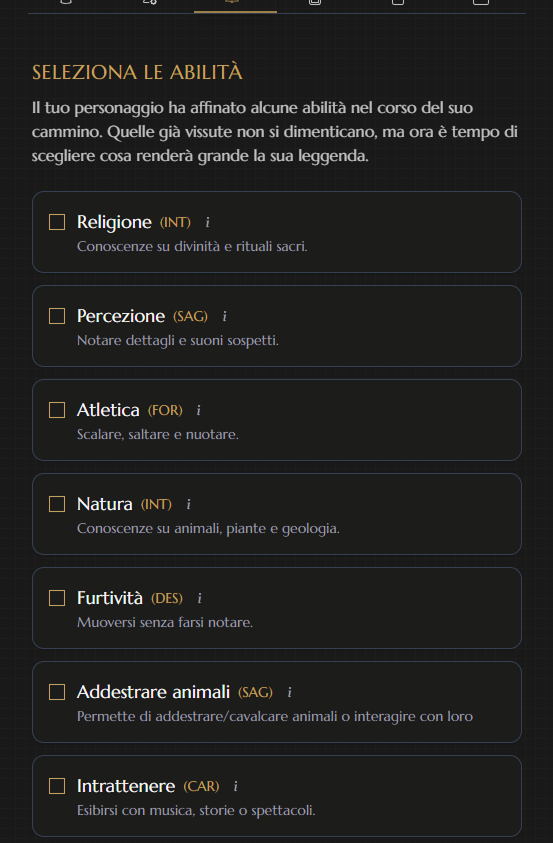
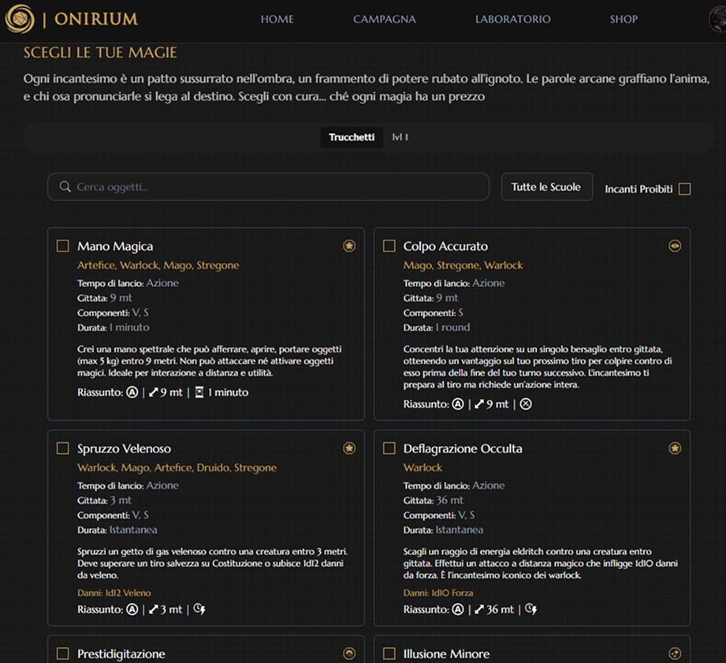

# 🐉 Onirium

<p align="center">
  
  <br>
  <em>La tua avventura inizia qui</em>
</p>


## 📜 Panoramica

**Onirium** è un'applicazione web dedicata ai giocatori di Dungeons & Dragons, progettata per semplificare la creazione e gestione dei personaggi, della campagna e favorire la condivisione di risorse tra i giocatori.

L'obiettivo principale è creare una community attiva dove gli utenti possano condividere personaggi, oggetti magici, incantesimi e homebrew, arricchendo l'esperienza di gioco con materiale creativo e ispirazione per campagne personalizzate.


## ✨ Caratteristiche Principali

### 🧙‍♂️ Creazione e Gestione del Personaggio
- Scheda personaggio altamente personalizzata che esula da molte regole dei manuali ufficiali
- Strumenti per personalizzazione avanzata (razze, classi, background, talenti)
- Sistema di multiclasse e avanzamento di livello

<div>






</div>

### 🏰 Gestione Campagne
- Strumenti per DM: tracciamento sessioni, gestione luoghi e missioni.
- Sistema di note condivise tra i giocatori
- Gestione degli incontri e dei tesori.


### 🛒 Shop e Community (in sviluppo)
- Marketplace per contenuti premium
- Forum di discussione e condivisione
- Profili utente personalizzati
- Sistema di valutazione per le creazioni della community

## 🛠️ Tecnologie Utilizzate

### Frontend
- **React.js** - Libreria per l'interfaccia utente
- **Redux** - Gestione dello stato dell'applicazione
- **Tailwind CSS** - Framework CSS utility-first
- **Radix UI** - Componenti UI accessibili e personalizzabili

### Backend
- **C# ASP.NET** - Framework per API REST
- **Entity Framework** - ORM per l'accesso ai dati

### Database
- **SQL Server** - Sistema di gestione database relazionale

## 🚀 Installazione

## Backend

### Apri il file OniriumBE.sln
Strumenti > Gestione pacchetti NuGet > Console di gestione pacchetti > 
```bash
dotnet restore
```

### Configurazione stringa di connessione

Apri il file appsettings.json e configura la striga:
```bash
  "ConnectionStrings": {
  "DefaultConnection": "Server=NOME_DEL_TUO_PC;User Id=TUO_USERNAME_SQL;Password=LA_TUA_PASSWORD_SQL;"
}
```

### Crea la migrazione e aggiorna il database

 Console di gestione pacchetti > 
 
 ```bash
Add-Migration Initial 
Update-Database
```

## Frontend


### Clona il repository
```bash
git clone https://github.com/Ninfa-C/Onirium.git
```
### Naviga nella directory del progetto
```bash
cd OniriumFE
```

### Installa le dipendenze
```bash
npm install
```

### Avvia l'applicazione in modalità sviluppo
```bash
npm run dev
```

## 🗺️ Roadmap e Sviluppi Futuri

### Fase 1 (Completata)
- ✅ Generatore di personaggi
- ✅ Sistema di account e salvataggio

### Fase 2 (completata)
- ✅ Strumenti per la gestione delle campagne
- ✅ Sistema di note condivise

### Fase 3 (Pianificata)
- 📅 Integrazione e-commerce
- 📅 Sezione community con profili utente
- 📅 Sistema di abbonamento per contenuti premium

## 👥 Contributi

Siamo aperti a contributi! Se desideri partecipare allo sviluppo di Onirium:

1. Fai un fork del repository
2. Crea un branch per la tua feature (`git checkout -b feature/AmazingFeature`)
3. Committa le tue modifiche (`git commit -m 'Add some AmazingFeature'`)
4. Pusha al branch (`git push origin feature/AmazingFeature`)
5. Apri una Pull Request

## 📞 Contatti

Nome del Progetto: [Onirium]

Email: ninfa_95@hotmail.it

---

<p align="center">
  Fatto con ❤️ per la community di D&D
</p>


Alcune icone Provenienti da: <p xmlns:cc="http://creativecommons.org/ns#" xmlns:dct="http://purl.org/dc/terms/"><a property="dct:title" rel="cc:attributionURL" href="https://github.com/intrinsical/tw-dnd/tree/main/icons">Intrinsical's D&D 5e Icon Set</a> by <a rel="cc:attributionURL dct:creator" property="cc:attributionName" href="https://github.com/intrinsical">David Kor Kian Wei</a> is licensed under <a href="https://creativecommons.org/licenses/by-sa/4.0/?ref=chooser-v1" target="_blank" rel="license noopener noreferrer" style="display:inline-block;">Creative Commons Attribution-ShareAlike 4.0 International </a></p>